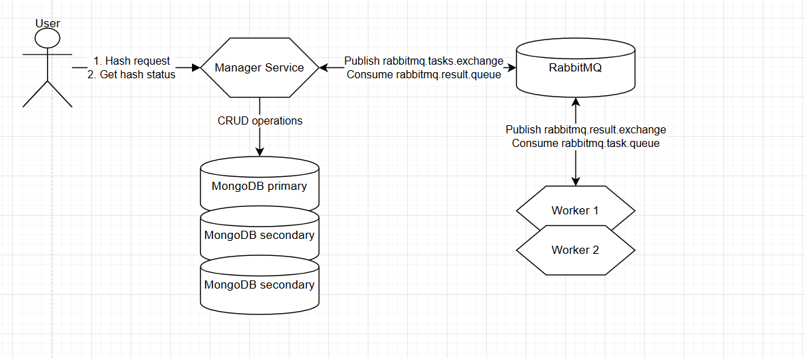

# Crack Hash System

**Distributed system for cracking MD5 hashes with fault tolerance**

---

## Architecture


The system consists of:
- **Manager Service** – принимает запросы на взлом хэшей, их статус и координирует обработку задач
- **Worker Services** – обрабатывает задачи по взлому хэшей параллельно
- **MongoDB Replica Set** – sхранит данные задач с репликацией для отказоустойчивости
- **RabbitMQ** – обеспечивает надежный обмен сообщениями между менеджером и воркерами
---

## Quickstart

### Requirements
- Java 21
- Maven
- Docker
- Docker Compose

### Clone repository
```bash
git clone https://github.com/vitalioo/ris-fault-tolerance.git

docker compose up --build -d